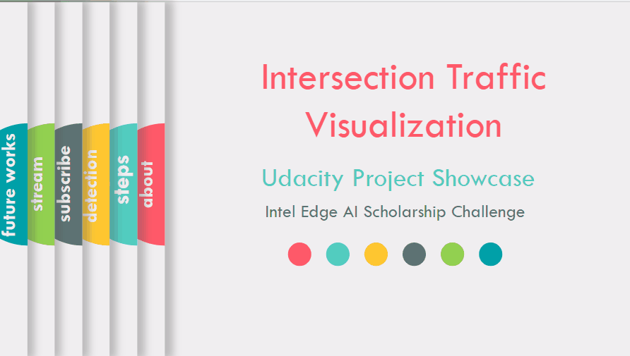

# Intersection Traffic Visualization

<a id='index'></a>
## Table of Contents
- [Project Overview](#overview)
- [Algorithmic Steps](#works)
- [Usage](#usage)
- [Code](#code)
- [References](#ref)


**_[Presentation](https://docs.google.com/presentation/d/1hhzI61B8x2jal5sdpufMWn0dHWDbvqb9n44FG8UvOgw/edit?usp=sharing)_**


<hr/> 

[Back to Table of Content](#index)

<a id='overview'></a>
## Project Overview
**Problem Statement:**
Traffic visualization in a busy intersection is critical to ensure convenient transportation of vehicles and safety for people.

**Our Solution:**
We are developing an intersection traffic visualization web app to discover patterns of traffic flows and manage the rush-hour traffic.

<a id='video'></a>
**_Deployed App_**


Running the App
This program is excuted in Udacity workspace.
First, get the MQTT broker and UI installed.

```
cd webservice/server
npm install
```
When complete, ```cd ../ui```
And again, ```npm install```

Then install react-plotly.js and plotly.js for time series visualization
```
npm install react-plotly.js plotly.js
```
You will need four separate terminal windows open in order to see the results. The steps below should be done in a different terminal based on number. You can open a new terminal in the workspace in the upper left (File>>New>>Terminal).

Get the MQTT broker installed and running.
```
cd webservice/server/node-server
node ./server.js
```
You should see a message that Mosca server started..
Get the UI Node Server running.
```
cd webservice/ui
npm run dev
```
After a few seconds, you should see webpack: Compiled successfully.
Start the ffserver
```
sudo ffserver -f ./ffmpeg/server.conf
```
Start the actual application.
First, you need to source the environment for OpenVINO in the new terminal:
```
source /opt/intel/openvino/bin/setupvars.sh -pyver 3.5
```
To run the app, I'll give you two items to pipe in with ffmpeg here, with the rest up to you:
```
python app.py -cv 0.6 -cp 0.2 -cb 0.1  | ffmpeg -v warning -f rawvideo -pixel_format bgr24 -video_size 1280x720 -framerate 24 -i - http://0.0.0.0:3004/fac.ffm
```
Your app should begin running, and you should also see the MQTT broker server noting information getting published.

In order to view the output, click on the "Open App" button below in the workspace.