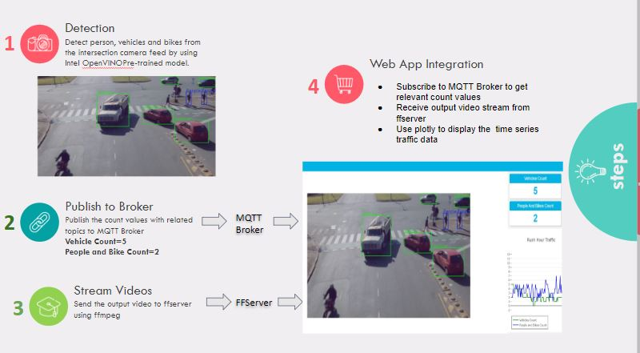
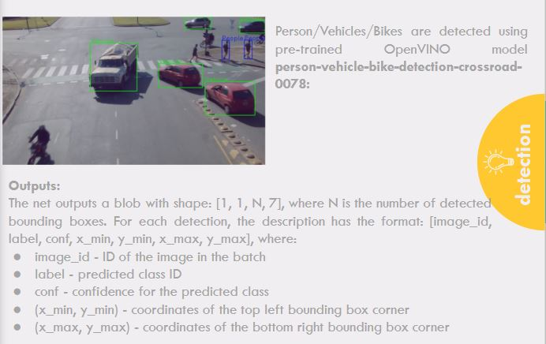
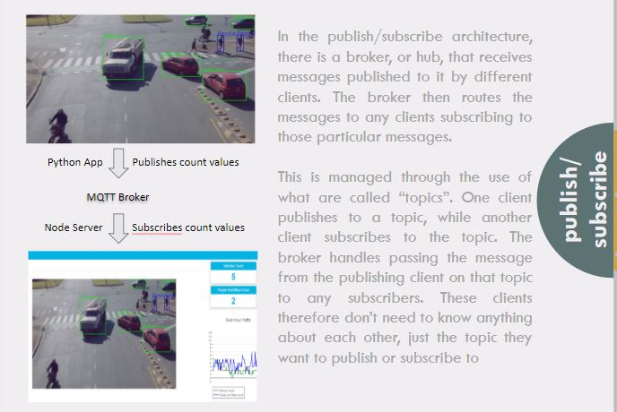
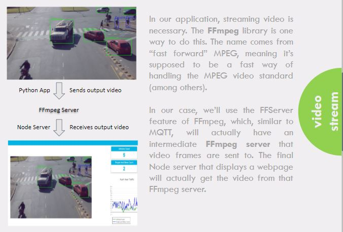
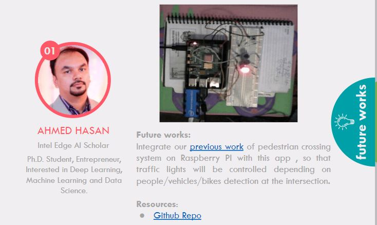
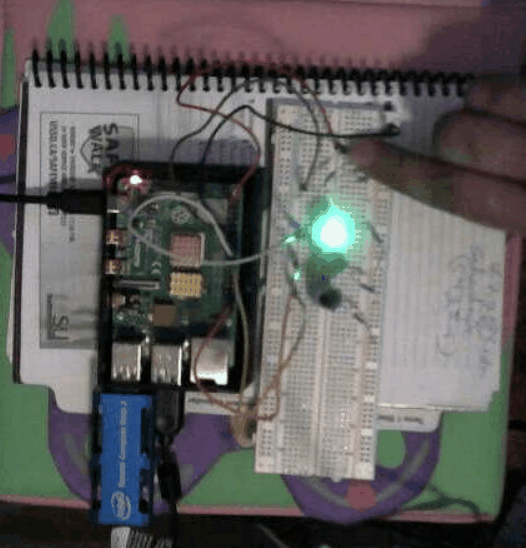

# Traffic Intersection Visualization

<a id='index'></a>
## Table of Contents
- [Project Overview](#overview)
- [Algorithmic Steps](#works)
- [Running the App](#usage)
- [Code](#code)
- [Future Works](#future)
- [References](#ref)


**_[Presentation](https://docs.google.com/presentation/d/1hhzI61B8x2jal5sdpufMWn0dHWDbvqb9n44FG8UvOgw/edit?usp=sharing)_**


<hr/> 

[Back to Table of Content](#index)

<a id='overview'></a>
## Project Overview
**Problem Statement:**
Traffic visualization in a busy intersection is critical to ensure convenient movement of vehicles and safety for people.

**Our Solution:**
We are developing an traffic intersection visualization web app to discover patterns of traffic flows and manage the rush-hour traffic.

<a id='video'></a>
**_Deployed App_**


<a id='works'></a>
## Algorithmic Steps



### Step 1: People/Vehicles/Bikes Detection



### Step 2: Publish/Subscribe to MQTT



### Step 3: Steaming Video



Refer to the [Code](#code) for more details.

<hr/> 

[Back to Table of Content](#index)

<a id='usage'></a>
## Running the App
This program is excuted in Udacity workspace.
First, get the MQTT broker and UI installed.

* ```cd webservice/server```
* ```npm install```
* When complete, ```cd ../ui```
* And again, ```npm install```

Then install react-plotly.js and plotly.js for time series visualization
```
npm install react-plotly.js plotly.js
```
You will need four separate terminal windows open in order to see the results. The steps below should be done in a different terminal based on number. You can open a new terminal in the workspace in the upper left (File>>New>>Terminal).

1. Get the MQTT broker installed and running.
	* ```cd webservice/server/node-server```
	* ```node ./server.js```
	* You should see a message that ```Mosca server started```.
1. Get the UI Node Server running.
	* ```cd webservice/ui```
	* ```npm run dev```
	* After a few seconds, you should see ```webpack: Compiled successfully```.
1. Start the ffserver
	* ```sudo ffserver -f ./ffmpeg/server.conf```
1. Start the actual application.
	* First, you need to source the environment for OpenVINO in the new terminal:
		* ```source /opt/intel/openvino/bin/setupvars.sh -pyver 3.5```
	* To run the app, I'll give you two items to pipe in with ffmpeg here, with the rest up to you:
		* ```python app.py -cv 0.6 -cp 0.2 -cb 0.1  | ffmpeg -v warning -f rawvideo -pixel_format bgr24 -video_size 1280x720 -framerate 24 -i - http://0.0.0.0:3004/fac.ffm```
		* Your app should begin running, and you should also see the MQTT broker server noting information getting published.

In order to view the output, click on the "Open App" button below in the workspace.

<hr/> 

[Back to Table of Content](#index)

<a id='code'></a>
## Code

### Arguments parsing in ```app.py```
```
def get_args():
    '''
    Gets the arguments from the command line.
    '''
    parser = argparse.ArgumentParser("Run inference on an input video")
    # -- Create the descriptions for the commands
    i_desc = "The location of the input file"
    d_desc = "The device name, if not 'CPU'"
    cv_desc = "The confidence threshold to use with the bounding boxes for vehicles"
    cp_desc = "The confidence threshold to use with the bounding boxes for people"
    cb_desc = "The confidence threshold to use with the bounding boxes for bikes"

    # -- Create the arguments
    parser.add_argument("-i", help=i_desc, default=INPUT_STREAM)
    parser.add_argument("-d", help=d_desc, default='CPU')
    parser.add_argument("-cv", help=cv_desc, default=0.5)
    parser.add_argument("-cp", help=cp_desc, default=0.5)
    parser.add_argument("-cb", help=cb_desc, default=0.5)    
    args = parser.parse_args()

    return args
```

### Drawing Bounding Boxes in ```app.py```
```
def draw_boxes(frame, result,args, width, height):
    '''
    Draw bounding boxes onto the frame.
    '''
    #class_array={ "1": "person", "2": "bicycle", "3": "car","4": "motorcycle","5": "airplane","6": "bus", "7": "train","8": "truck","9": "boat","10":"traffic light"}
    vehicles=[]
    people_count=0
    bike_count=0
    for box in result[0][0]: # Output shape is 1x1x100x7
        conf = box[2]
        box_class=int(box[1])
        #class_obj=class_array.get(str(box[1]))
        #print(str(box[1]))
        if conf >= float(args.cv) and box_class==2:
            xmin = int(box[3] * width)
            ymin = int(box[4] * height)
            xmax = int(box[5] * width)
            ymax = int(box[6] * height)
            cv2.rectangle(frame, (xmin, ymin), (xmax, ymax), (255,0,255), 2)
            cv2.putText(frame,"Vehicle",(xmin,ymin),cv2.FONT_HERSHEY_DUPLEX , 1, (255,0,255))
            vehicles.append(box_class)
        if conf >= float(args.cp) and box_class==1:
            xmin = int(box[3] * width)
            ymin = int(box[4] * height)
            xmax = int(box[5] * width)
            ymax = int(box[6] * height)
            cv2.rectangle(frame, (xmin, ymin), (xmax, ymax), (255,0,0), 2)
            cv2.putText(frame,"People",(xmin,ymin),cv2.FONT_HERSHEY_DUPLEX , 1, (255,0,0))
            people_count+=1
        if conf >= float(args.cb) and box_class==3:
            xmin = int(box[3] * width)
            ymin = int(box[4] * height)
            xmax = int(box[5] * width)
            ymax = int(box[6] * height)
            cv2.rectangle(frame, (xmin, ymin), (xmax, ymax), (255,0,0), 2)
            cv2.putText(frame,"Bike",(xmin,ymin),cv2.FONT_HERSHEY_DUPLEX , 1, (255,0,0))
            people_count+=1

    return frame,vehicles,people_count
```

### Plotly Visualization in ```Stats.jsx```
```
  <div>
      <Plot
          data={[
              {
                  y:this.state.currentFrameData,
                  type:'line',
                  marker:{color:'#ff00ff'},
                  name:'Vehicles'
              },
              {
                  y:this.state.currentSpeedData,
                  type:'line',
                  marker:{color:'blue'},
                  name:'People and Bikes'
              }
          ]}
          layout={{
              width:'350',height:'400',
              title:'Traffic Visualization',
              showlegend: true,
             plot_bgcolor: "lightgray",
              legend: {"orientation": "h",
                      bfcolor:'lightgray',
                      bordercolor:'gray',
                      borderwidth:2},
              margin: {
                l: 35,
                r: 60,
                t:40
               },
              xaxis: {
                 autorange: 'reversed',
                showgrid: false,
                zeroline: false,
                showline: false,
                autotick: true,
                ticks: '',
                showticklabels: false
              },
              yaxis: {
                  title:'Count',
                  range: [0, 12],
                  autotick: false,
                    ticks: 'outside',
                    tick0: 0,
                    dtick: 1,
                    tickcolor: '#000'
                }
          }}
       />
          
  </div>    
```

<hr/>

[Back to Table of Content](#index)

<a id='future'></a>
## Future Works



### Pedestrian Crossing System 


<a id='ref'></a>
## References
1. [Presentation](https://docs.google.com/presentation/d/1hhzI61B8x2jal5sdpufMWn0dHWDbvqb9n44FG8UvOgw/edit?usp=sharing)

<hr/> 

[Back to Table of Content](#index)